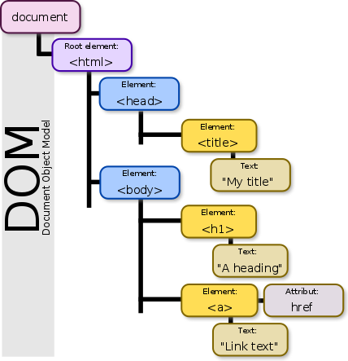

### Questions:
1. What is the DOM?
    * DOM stands for `Document Object Model` and that means it treats the HTML document like a tree structure where each node is an object that represents the document

    * 
2. What is an event?
    * Events are objects based on the `Event Interface` and they represent all the basis user interactions happening on the rendering model.
3. What is an event listener?
    * Going from the answer above about the event. The event listener is a function that waits for an event to occur and when it does it will trigger specific code that is assigned to that event listener. A simple example on what is an event listener is pressing a key on the keyboard, moving the mouse or scrolling the screen.
4. Why would we convert a NodeList into an Array?
    * By converting a NodeList to an array we have access to the prototype functions like forEach, map and reduce that a NodeList doesn't have available. Some people get confused why NodeList doesn't have this functions and is because NodeList is like an array object but it's not an array.
5. What is a component?
    * A component is a reusable piece of code that share the samen functionality but there is a common ground to make integration easier. An example of this is a Date Picker or a slider.
